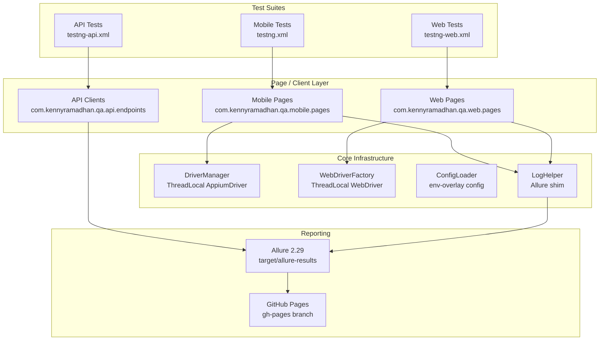

# QA Automation Portfolio — Mobile + Web + API

[](https://github.com/kennyRamadhan/selenium-java-testng-automation-portofolio/actions/workflows/ci.yml)
[](https://kennyRamadhan.github.io/selenium-java-testng-automation-portofolio/)
[](https://adoptium.net/)
[](https://maven.apache.org/)
[](LICENSE)

A production-grade test automation framework demonstrating end-to-end testing across **mobile (Appium)**, **web (Selenium)**, and **API (RestAssured)** layers using a unified Java 25 + TestNG architecture.

> Companion to my [Python framework](https://github.com/kennyRamadhan/playwright-api-web-mobile) — same architectural principles, different stack.

---

## 🎯 Demo Targets

| Layer  | Target                       | Address                                                  |
| ------ | ---------------------------- | -------------------------------------------------------- |
| Web    | Automation Exercise          | https://automationexercise.com                           |
| API    | Automation Exercise API      | https://automationexercise.com/api_list                  |
| Mobile | SauceLabs SwagLabs Demo App  | iOS / Android (local emulator or BrowserStack)           |

---

## 🛠 Tech Stack

| Concern         | Tool                                  |
| --------------- | ------------------------------------- |
| Language        | Java 25 LTS (Temurin)                 |
| Build           | Maven 3.9                             |
| Test framework  | TestNG 7.10                           |
| Mobile          | Appium java-client 8.6                |
| Web             | Selenium 4.27 + WebDriverManager 5.9  |
| API             | RestAssured 5.5 + Jackson 2.18        |
| Reporting       | Allure 2.29                           |
| Logging         | SLF4J 2.0 + Logback 1.5               |
| Assertion       | AssertJ 3.26                          |
| Test data       | Datafaker 2.4                         |
| Code quality    | Spotless 2.43 (Google Java Format)    |
| CI              | GitHub Actions                        |

---

## 📁 Architecture



The three test layers share `ConfigLoader` for environment-overlay configuration but each owns its own driver/client lifecycle. Allure is the single reporting backend; `LogHelper` is a thin shim preserving the legacy ExtentReports-style API while delegating to Allure under the hood. See [docs/ARCHITECTURE.md](docs/ARCHITECTURE.md) for the full design rationale.

---

## 🚀 Quick Start

### Prerequisites

- **Java 25 LTS** (Temurin recommended) — verify with `java -version`
- **Maven 3.9+** — verify with `mvn -version`
- **Chrome / Firefox / Edge** for web tests (WebDriverManager auto-resolves the driver binary)
- **Appium server + Android Studio or Xcode** for mobile tests (mobile suite is excluded from default CI; see [docs/ARCHITECTURE.md](docs/ARCHITECTURE.md) for execution channels)

### Clone and build

```bash
git clone https://github.com/kennyRamadhan/selenium-java-testng-automation-portofolio.git
cd selenium-java-testng-automation-portofolio
mvn clean compile
```

### (Optional) Install local git hooks

```bash
bash scripts/install-hooks.sh
```

Installs a `pre-commit` hook that runs Spotless and a `commit-msg` hook that blocks AI-attribution lines. Hooks are tracked under `.githooks/` and copied into `.git/hooks/` by the script.

### Run tests

| Goal                       | Command                                                              |
| -------------------------- | -------------------------------------------------------------------- |
| API smoke (3 tests, ~10s)  | `mvn test -P api -Dgroups=smoke`                                     |
| API full (15 tests, ~30s)  | `mvn test -P api`                                                    |
| Web smoke (4 tests, ~80s)  | `mvn test -P web -Dgroups=smoke -Dheadless=true`                     |
| Web full (8 tests)         | `mvn test -P web -Dheadless=true`                                    |
| Mobile (default suite)     | `mvn test`  *(requires running Appium + emulator/device)*            |
| Web on BrowserStack cloud  | `mvn test -P web,browserstack -Dbrowser=chrome`  *(requires creds)*  |

For a full local-development walkthrough including IDE setup, see [docs/GETTING_STARTED.md](docs/GETTING_STARTED.md).

---

## 📊 Reports

Allure report auto-published to GitHub Pages on every push:
**[https://kennyRamadhan.github.io/selenium-java-testng-automation-portofolio/](https://kennyRamadhan.github.io/selenium-java-testng-automation-portofolio/)**

> Screenshot pending — first CI publish will populate this section.

To view the report locally after a test run:

```bash
mvn allure:serve
```

This starts a local web server with the report rendered from `target/allure-results/`.

---

## 🏗 Design Decisions

See [docs/ARCHITECTURE.md](docs/ARCHITECTURE.md) for in-depth rationale on:

- **Why Allure over ExtentReports** — first-class TestNG SPI integration, GitHub Pages publishing, less infra around it
- **Why no PageFactory** — explicit `By` constants are easier to grep, easier to refactor, and avoid the proxy magic that made test failures hard to debug
- **Why ThreadLocal driver** — TestNG `parallel="methods"` requires per-thread isolation; ThreadLocal is the simplest correct primitive
- **Why cross-layer cleanup (web → API)** — the AE.com `/api/deleteAccount` endpoint is more reliable than its web equivalent for tearing down test fixtures
- **Multi-environment config strategy** — base `config.properties` + per-env overlay (`config-{env}.properties`) + runtime variable resolution

---

## 📚 Documentation

- [Getting Started](docs/GETTING_STARTED.md) — local dev setup walkthrough
- [Architecture](docs/ARCHITECTURE.md) — design decisions and rationale
- [Contributing](CONTRIBUTING.md) — branch naming, commit format, PR template

---

## 📜 License

MIT — see [LICENSE](LICENSE).
