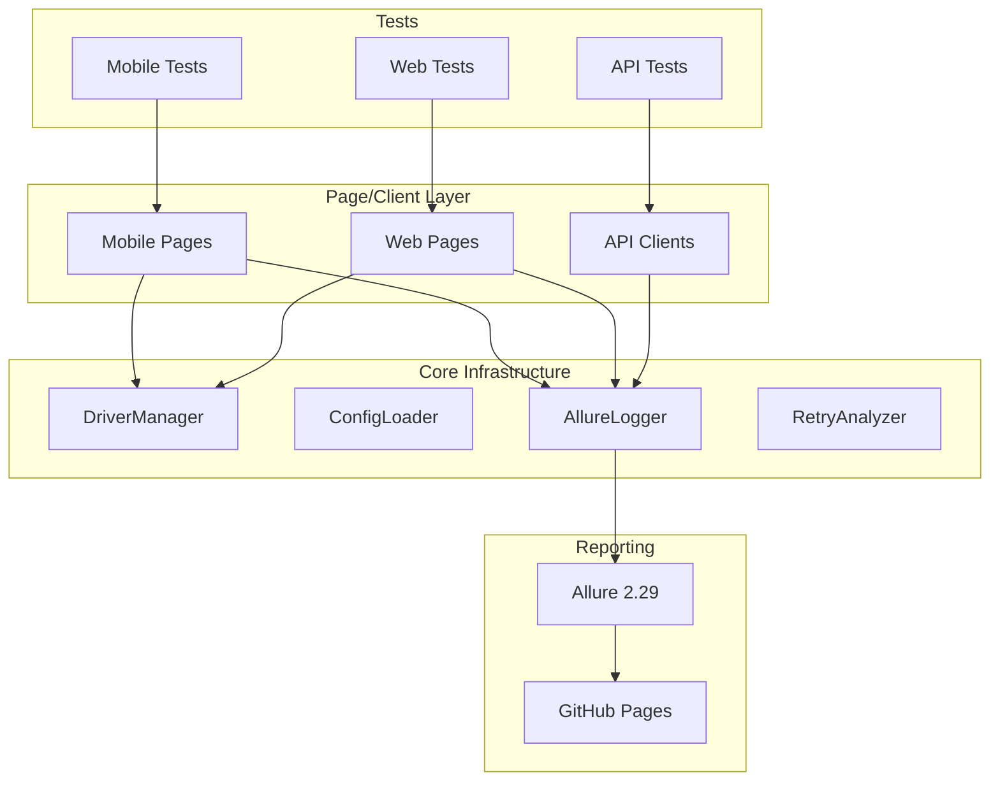

# Phase 6 — CI/CD + Polish

**Goal:** Production-grade GitHub Actions CI, Allure publishing to gh-pages, comprehensive documentation rewrite, and code quality tooling.

**Total commits:** 5
**Estimated time:** 3-5 hours
**Prerequisite:** Phase 5 complete (mobile + web + API layers all functional)

---

## Required Reading

1. `CLAUDE.md` — agent rules
2. `MASTER_PLAN.md` — Section "Phase 6 — CI/CD + Polish" + "Final" merge step
3. `phase-5-handoff.md` — what was just completed
4. Reference: Kenny's Python repo CI workflow (https://github.com/kennyRamadhan/playwright-api-web-mobile/blob/main/.github/workflows/) — mirror its structure for Java equivalence

---

## Commits to Create (in order)

### Commit 6.1: `ci: add GitHub Actions for PR validation`

**File: `.github/workflows/ci.yml`**

```yaml
name: CI

on:
  pull_request:
    branches: [main]
  push:
    branches: [main, refactor/v2]

jobs:
  build-and-api-test:
    name: Build + API Tests
    runs-on: ubuntu-latest
    steps:
      - name: Checkout
        uses: actions/checkout@v4

      - name: Setup Java 25
        uses: actions/setup-java@v4
        with:
          distribution: 'temurin'
          java-version: '25'
          cache: 'maven'

      - name: Build
        run: mvn -B clean compile

      - name: Compile tests
        run: mvn -B test-compile

      - name: API Tests (smoke)
        run: mvn -B test -P api -Dgroups=smoke
        continue-on-error: false

      - name: Upload Allure results
        if: always()
        uses: actions/upload-artifact@v4
        with:
          name: allure-results-api
          path: target/allure-results
          retention-days: 7

  web-test:
    name: Web Tests (headless)
    runs-on: ubuntu-latest
    needs: build-and-api-test
    steps:
      - uses: actions/checkout@v4

      - name: Setup Java 25
        uses: actions/setup-java@v4
        with:
          distribution: 'temurin'
          java-version: '25'
          cache: 'maven'

      - name: Setup Chrome
        uses: browser-actions/setup-chrome@v1

      - name: Web Tests (smoke, headless)
        run: mvn -B test -P web -Dweb.headless=true -Dgroups=smoke

      - name: Upload Allure results
        if: always()
        uses: actions/upload-artifact@v4
        with:
          name: allure-results-web
          path: target/allure-results
          retention-days: 7

  # Mobile tests are skipped in CI by default — emulator setup is heavy.
  # Run locally or via BrowserStack with `mvn test -P mobile,browserstack`.
```

**Verification:**
- Push to GitHub, observe Actions tab
- PR validation triggers on PR creation

---

### Commit 6.2: `ci: add Allure report publishing to gh-pages`

**File: `.github/workflows/allure-publish.yml`**

```yaml
name: Allure Report Publish

on:
  push:
    branches: [main]
  workflow_dispatch:  # manual trigger

permissions:
  contents: write
  pages: write
  id-token: write

jobs:
  publish-allure:
    name: Publish Allure Report
    runs-on: ubuntu-latest
    steps:
      - uses: actions/checkout@v4

      - name: Setup Java 25
        uses: actions/setup-java@v4
        with:
          distribution: 'temurin'
          java-version: '25'
          cache: 'maven'

      - name: Setup Chrome
        uses: browser-actions/setup-chrome@v1

      - name: Run all suites except mobile
        run: |
          mvn -B test -P api || true
          mvn -B test -P web -Dweb.headless=true || true

      - name: Get Allure history (gh-pages)
        uses: actions/checkout@v4
        if: always()
        continue-on-error: true
        with:
          ref: gh-pages
          path: gh-pages

      - name: Generate Allure report
        if: always()
        uses: simple-elf/allure-report-action@v1.7
        with:
          allure_results: target/allure-results
          allure_history: allure-history
          gh_pages: gh-pages
          keep_reports: 30

      - name: Deploy to GitHub Pages
        if: always()
        uses: peaceiris/actions-gh-pages@v4
        with:
          github_token: ${{ secrets.GITHUB_TOKEN }}
          publish_branch: gh-pages
          publish_dir: allure-history
          keep_files: true
```

**Manual setup required by Kenny (not the agent):**
1. Enable GitHub Pages in repo settings → Pages → Source: `gh-pages` branch
2. After first run, report available at: `https://kennyRamadhan.github.io/selenium-java-testng-automation-portofolio/`

**Verification:**
- Workflow visible in Actions tab
- After merge to main, gh-pages branch created with report

---

### Commit 6.3: `docs: rewrite README with badges, architecture, and screenshots`

**File: `README.md`** — full rewrite. Structure:

```markdown
# QA Automation Portfolio — Mobile + Web + API

[](https://github.com/kennyRamadhan/selenium-java-testng-automation-portofolio/actions/workflows/ci.yml)
[](https://kennyRamadhan.github.io/selenium-java-testng-automation-portofolio/)
[](https://adoptium.net/)
[](https://maven.apache.org/)
[](https://opensource.org/licenses/MIT)

A production-grade test automation framework demonstrating end-to-end testing across **mobile (Appium)**, **web (Selenium)**, and **API (RestAssured)** layers using a unified Java 25 + TestNG architecture.

> Companion to my [Python framework](https://github.com/kennyRamadhan/playwright-api-web-mobile) — same architectural principles, different stack.

## 🎯 Demo Targets

| Layer | Target | URL |
|---|---|---|
| Web | Automation Exercise | https://automationexercise.com |
| API | Automation Exercise API | https://automationexercise.com/api_list |
| Mobile | SauceLabs SwagLabs Demo App | iOS / Android |

## 🛠 Tech Stack

| Concern | Tool |
|---|---|
| Language | Java 25 LTS (Temurin) |
| Build | Maven 3.9 |
| Test framework | TestNG 7.10 |
| Mobile | Appium java-client 9.3 |
| Web | Selenium 4.27 + WebDriverManager 5.9 |
| API | RestAssured 5.5 + Jackson 2.18 |
| Reporting | Allure 2.29 |
| Logging | SLF4J 2.0 + Logback 1.5 |
| Assertion | AssertJ 3.26 |
| Test data | Datafaker 2.4 |

## 📁 Architecture

[Insert architecture diagram here — mermaid block]

## 🚀 Quick Start

### Prerequisites

[Embed the section drafted earlier in conversation]

### Running Tests

[mvn commands per profile]

## 📊 Reports

Allure report auto-published to GitHub Pages: https://kennyRamadhan.github.io/selenium-java-testng-automation-portofolio/

[Screenshot of Allure dashboard]

## 🏗 Design Decisions

See [docs/ARCHITECTURE.md](docs/ARCHITECTURE.md) for in-depth rationale on:
- Why Allure over ExtentReports
- Why no PageFactory
- Why RetryAnalyzer + group-based execution
- Multi-environment config strategy

## 📚 Documentation

- [Getting Started](docs/GETTING_STARTED.md) — local dev setup
- [Architecture](docs/ARCHITECTURE.md) — design decisions
- [Contributing](CONTRIBUTING.md)

## 📜 License

MIT — see [LICENSE](LICENSE)
```

**Add architecture diagram** as inline Mermaid block in README:



**Take a screenshot of an Allure report** (Kenny will provide one or agent can use a placeholder URL until first CI run produces actual report).

**Verification:** Visual review of GitHub-rendered README.

---

### Commit 6.4: `docs: add ARCHITECTURE.md, GETTING_STARTED.md, CONTRIBUTING.md, LICENSE`

**Files to create under `docs/`:**

**`ARCHITECTURE.md`** — comprehensive design rationale:
- Module structure rationale
- Page Object pattern (and why no PageFactory)
- Driver lifecycle strategy
- Reporting architecture (Allure choice)
- Multi-environment configuration
- Retry & flake handling
- Parallel execution strategy

**`GETTING_STARTED.md`** — local dev walkthrough (full version of section drafted in conversation):
- Prerequisites with exact install commands (Scoop on Windows, Homebrew on macOS, apt on Linux)
- Eclipse setup (with screenshots placeholders)
- IntelliJ setup
- Running tests per profile
- Debugging tips
- Common pitfalls

**Files at repo root:**

**`CONTRIBUTING.md`:**
- Branch naming convention
- Commit message format (conventional commits)
- PR description template
- Code review checklist

**`LICENSE`:** MIT license, copyright Kenny Ramadhan, year 2026.

**`.editorconfig`** at root:
```ini
root = true

[*]
charset = utf-8
end_of_line = lf
insert_final_newline = true
trim_trailing_whitespace = true
indent_style = space
indent_size = 4

[*.{md,yml,yaml}]
indent_size = 2

[*.{xml,html}]
indent_size = 2
```

**`.gitattributes`** at root:
```
* text=auto eol=lf
*.bat text eol=crlf
*.sh text eol=lf
*.png binary
*.jpg binary
*.apk binary
*.app binary
```

**Verification:**
```bash
ls docs/
cat .editorconfig
cat .gitattributes
```

---

### Commit 6.5: `chore: add Spotless formatting and pre-commit safeguards`

**File: `pom.xml`** — add Spotless plugin:

```xml
<plugin>
    <groupId>com.diffplug.spotless</groupId>
    <artifactId>spotless-maven-plugin</artifactId>
    <version>2.43.0</version>
    <configuration>
        <java>
            <importOrder>
                <order>java,javax,org,com,com.kennyramadhan,</order>
            </importOrder>
            <removeUnusedImports/>
            <eclipse>
                <version>4.30</version>
            </eclipse>
        </java>
        <pom>
            <sortPom>
                <expandEmptyElements>false</expandEmptyElements>
            </sortPom>
        </pom>
    </configuration>
    <executions>
        <execution>
            <goals>
                <goal>check</goal>
            </goals>
        </execution>
    </executions>
</plugin>
```

**File: `.git/hooks/pre-commit`** (note: hooks live outside tracked files):

```bash
#!/bin/sh
# Run Spotless check before commit
mvn -q spotless:check
if [ $? -ne 0 ]; then
    echo "ERROR: Spotless check failed. Run 'mvn spotless:apply' to auto-fix, then re-commit."
    exit 1
fi
```

**File: `scripts/install-hooks.sh`** (tracked, run by contributors):
```bash
#!/bin/sh
# Install git hooks for this repo
HOOKS_SRC=".githooks"
HOOKS_DST=".git/hooks"

cp $HOOKS_SRC/* $HOOKS_DST/
chmod +x $HOOKS_DST/*
echo "Git hooks installed."
```

**File: `.githooks/commit-msg`** (tracked source for commit-msg hook, copied to .git/hooks via install script):

```bash
#!/bin/sh
# Block AI attribution in commit messages
COMMIT_MSG_FILE=$1

if grep -iE "Co-Authored-By:.*(Claude|anthropic)" "$COMMIT_MSG_FILE" > /dev/null; then
  echo "ERROR: AI attribution detected in commit message."
  exit 1
fi

if grep -iE "(Generated with|Created by).*Claude" "$COMMIT_MSG_FILE" > /dev/null; then
  echo "ERROR: AI generation marker detected in commit message."
  exit 1
fi

exit 0
```

**File: `.githooks/pre-commit`** — same content as the inline version above.

Update README's Quick Start to mention `bash scripts/install-hooks.sh` after clone.

**Verification:**
```bash
mvn spotless:check  # should pass after auto-format
mvn spotless:apply
```

---

## Final Step (After All Commits): Merge to Main

This is **Kenny's responsibility, not the agent's.** Once Phase 6 commits are pushed, the workflow is:

1. Open PR from `refactor/v2` → `main` on GitHub
2. PR description should reference master plan and list all phases
3. Merge with **squash and merge** (linear history) OR **merge commit** (preserves all 25-30 commits as story arc)
4. Tag release `v2.0.0` after merge
5. Optional: Create GitHub Release with changelog

**Recommended:** Merge commit (preserve commits) — recruiters reading the repo see the deliberate refactor narrative.

---

## Phase-Specific Constraints

1. **Mobile tests excluded from CI by default.** Emulator setup is too heavy. Document this in CI workflow comments.
2. **GitHub Pages enable is manual.** Document in README the one-time setup step.
3. **Spotless rules must not conflict with Eclipse default formatter.** Test by running `mvn spotless:apply` and checking diff is reasonable.
4. **Pre-commit hook is opt-in** via `scripts/install-hooks.sh` — cannot enforce on contributors automatically without external tools.

---

## Definition of Done

After all 5 commits:
1. `.github/workflows/ci.yml` and `.github/workflows/allure-publish.yml` exist
2. README has badges, architecture diagram, quick start, and screenshots/links
3. `docs/ARCHITECTURE.md`, `docs/GETTING_STARTED.md`, `CONTRIBUTING.md`, `LICENSE` exist
4. `.editorconfig`, `.gitattributes` exist
5. Spotless plugin configured in pom.xml
6. `mvn spotless:check` passes
7. `.githooks/` directory contains commit-msg + pre-commit
8. `scripts/install-hooks.sh` exists and is executable
9. CI workflow successful on first push (visible in Actions tab)
10. Push to origin

---

## Reporting Format

```
Phase 6 complete: CI/CD + Polish

Commits:
- <SHA1> ci: add GitHub Actions for PR validation
- <SHA2> ci: add Allure report publishing to gh-pages
- <SHA3> docs: rewrite README with badges, architecture, screenshots
- <SHA4> docs: add ARCHITECTURE.md, GETTING_STARTED.md, CONTRIBUTING.md, LICENSE
- <SHA5> chore: add Spotless formatting and pre-commit safeguards

Verification:
- ci.yml workflow: ✅ green on push
- README rendered correctly on GitHub: ✅
- docs/ directory populated: ✅
- mvn spotless:check: ✅ passes
- Pre-commit hook: ✅ blocks AI attribution

Pushed to: origin/refactor/v2

Action required from Kenny:
1. Enable GitHub Pages: Settings → Pages → Source: gh-pages branch
2. Open PR refactor/v2 → main on GitHub
3. After merge to main, allure-publish workflow runs and publishes report
4. Tag release v2.0.0

Refactor complete. All 7 phases done.
```

---

## Stop Conditions

Stop and ask Kenny if:
- Spotless formatter reformats hundreds of lines unexpectedly (might indicate config mismatch)
- GitHub Actions free tier minute limits become a concern (large suite)
- Mermaid diagram in README doesn't render correctly on GitHub
- Allure publish action version is deprecated (action@v1.7 may need update)
- Any breaking change between Java 25 and Maven 3.9 surfaces during CI

This is the final phase. After Phase 6, the agent's work on this branch is complete. Kenny owns the merge.
